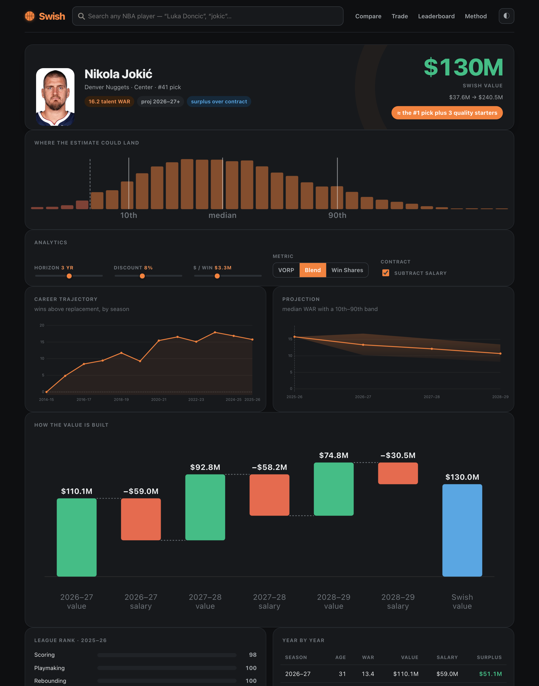
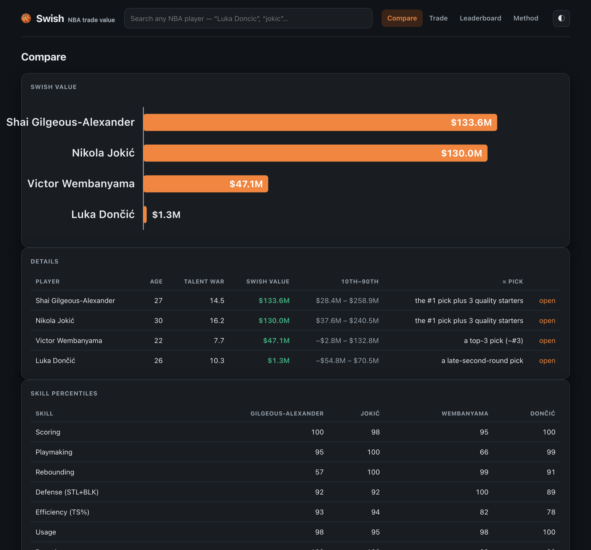
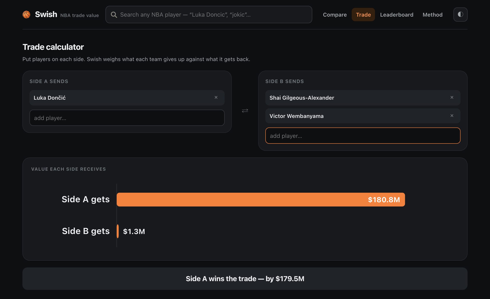
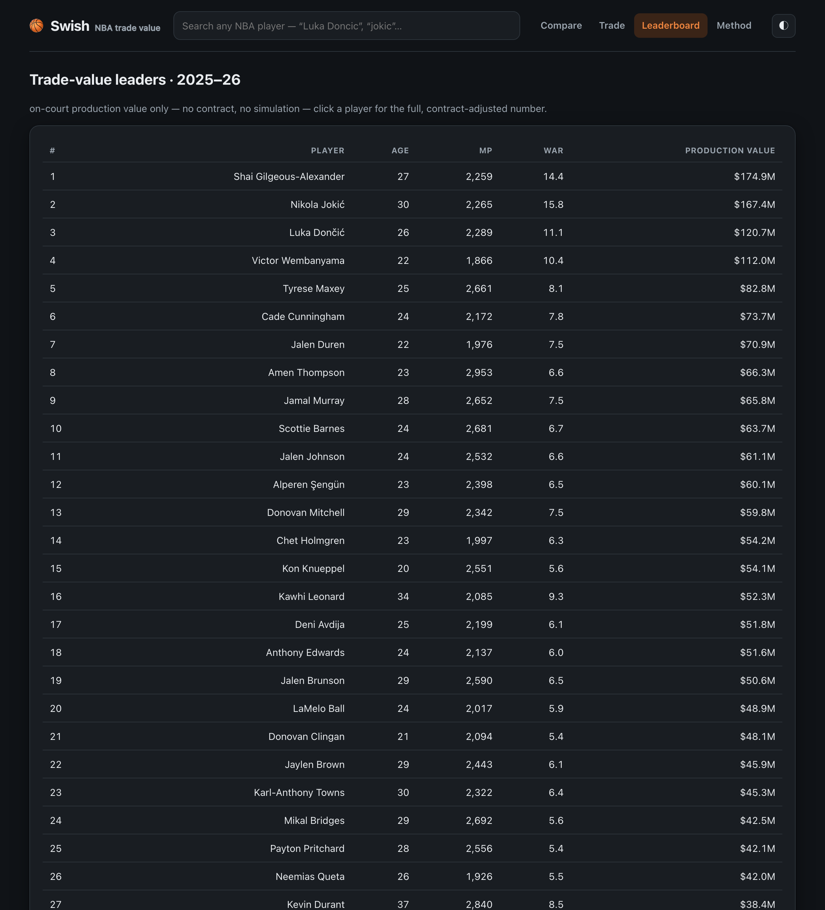

# 🏀 Swish

Estimate an NBA player's trade value from his stats and his contract.

[](https://github.com/Samprit67/swish/actions/workflows/ci.yml)


Type in a name. Swish pulls the player's career from Basketball-Reference,
projects his production forward with an age curve, prices those wins in dollars,
subtracts what he's owed, and returns what the asset is worth. The answer comes
back on a scale you can read as draft picks, with an honest uncertainty band.

<p align="center">
  
</p>

```bash
pip install -e .
swish value "Nikola Jokic"      # full breakdown in the terminal
swish serve                     # dashboard at http://127.0.0.1:8770
```

## Why I built this

Every trade deadline the same argument happens: is this a fair deal? Analysts
answer it with a rough mental model. How good is the player, how long will he
stay that good, what's he getting paid, and how does that stack up against a
draft pick. I wanted to write that model down so it's explicit and reproducible
instead of vibes, and so I could point it at any player and get a number back.

The interesting part isn't scraping stats. It's the chain from a stat line to a
dollar figure: turning box-score metrics into wins without letting the best
players run away to absurd numbers, regressing a noisy single season toward
something stable, aging the projection, and pricing wins in a way that reflects
that a superstar on one roster spot is worth more than three good role players.
That model lives in [`swish/model/`](swish/model/) and is written up in
[`docs/METHODOLOGY.md`](docs/METHODOLOGY.md).

It's deliberately not a fan. It prices Dallas trading Luka Dončić as more
defensible than the consensus reaction, and it's bearish on young high-volume
scorers whose all-in-one metrics haven't caught up yet. Whether that's the model
being wrong or being early is left to the reader.

## What it does

| | |
|---|---|
| **Any player** | Resolves a name (accents, typos, "gilgeous alexander", or a raw Basketball-Reference id). This season's rotation ships in a committed snapshot and answers instantly; everyone else is fetched live. |
| **A trade-value number** | Projected wins times the market price of a win, discounted and cap-inflated, minus guaranteed salary. That surplus is expressed on a draft-pick scale, like "about the #7 pick". |
| **The whole chain, shown** | Career WAR trajectory, the aging projection with a 10th to 90th percentile fan, a waterfall from production value to salary to surplus, league percentile bars, and a skill radar on the compare view. Every intermediate number the model computed is on screen. |
| **Uncertainty** | A 5,000-run Monte Carlo over talent, aging, health, and cost per win produces a 10th to 90th percentile range, not just a point estimate. |
| **Live analytics** | Sliders for horizon, discount rate, and cost per win. Toggles for the metric (VORP, Win Shares, or a blend) and for whether to subtract salary. Everything recomputes. |
| **Compare** | Two to four players side by side, with value bars and a skill radar. |
| **Trade calculator** | Put players on each side. Swish weighs what each team gives up against what it gets back and calls it. |
| **Leaderboard** | League-wide production-value leaders for a season, from a single request. |
| **Local first** | The current season ships as a committed snapshot (`swish/data/season.json`), so a fresh clone or deploy runs with no network. Anything fetched live is cached in SQLite on top of that. |
| **A CLI too** | `swish value`, `compare`, `trade`, and `leaderboard`, all with a `--json` flag. |

## Screenshots

| Compare | Trade calculator | Leaderboard |
|---|---|---|
|  |  |  |

## Quickstart

```bash
git clone https://github.com/Samprit67/swish
cd swish
python -m venv .venv && source .venv/bin/activate
pip install -e ".[dev]"

swish value "Victor Wembanyama"
swish compare "Luka Doncic" "Shai Gilgeous-Alexander" "Jayson Tatum"
swish trade --a "Zion Williamson" --b "Jaylen Brown"
swish serve
```

This season's rotation (about 320 players, ranked by minutes) ships in
`swish/data/season.json`, so those lookups are instant and need no network.
Search a deep-bench or retired player and Swish fetches him from
basketball-reference.com, which takes a second or two; a token-bucket throttle
keeps the crawl polite. Anything fetched live is cached in SQLite
(`~/Library/Application Support/swish/cache.db` on macOS,
`$XDG_DATA_HOME/swish` on Linux) so the second lookup is instant too. Run
`swish cache info` to see what's stored, `swish data info` for the snapshot, or
`swish data build` to rebuild it when the season moves on.

## How the number is built

```
name -> basketball-reference.com -> career per-game + advanced + contract

  1. blend VORP and Win Shares into wins above replacement (calibrated)
  2. regress the last three seasons toward the player's own recent form
  3. apply an age curve to project the next N seasons
  4. price the wins: about $3.3M each, grown with the cap, discounted,
     with a premium for production concentrated on one roster spot
  5. subtract guaranteed salary to get surplus value
  6. map the surplus onto a draft-pick-value curve
  7. resample every step 5,000 times for the 10th / 50th / 90th percentile
```

Every step is a pure, typed function over plain dataclasses, and every constant
sits in [`swish/model/params.py`](swish/model/params.py) with a source. The full
write-up is in [`docs/METHODOLOGY.md`](docs/METHODOLOGY.md), with the layout in
[`docs/ARCHITECTURE.md`](docs/ARCHITECTURE.md) and the scraping details in
[`docs/DATA.md`](docs/DATA.md).

## Tech

- Python 3.10+, FastAPI and Uvicorn, a Typer CLI, NumPy for the model
- Data: a committed season snapshot (`swish data build`), plus a live scraper for the long tail (httpx, BeautifulSoup and lxml, rate limited, SQLite response cache)
- Frontend: vanilla ES modules, no build step, SVG charts written by hand in [`swish/web/charts.js`](swish/web/charts.js)
- Tooling: ruff, mypy (strict on the model core), pytest with Hypothesis, GitHub Actions

## Testing

```bash
pytest                 # 77 tests, around 14 seconds, fully offline
pytest --cov=swish
ruff check swish tests && ruff format --check swish tests
mypy swish
```

The suite runs against recorded Basketball-Reference HTML in
[`tests/fixtures/`](tests/fixtures/). The scraper's network call is the only
thing stubbed, so the parsers and the model run against real captured pages.
The model carries property tests: more WAR always means more value, a younger
player is worth more at equal production, a higher salary means less surplus,
and the percentiles stay ordered.

## Known limitations

- **One blended box-score metric.** VORP and Win Shares are both box-score
  derived, and they underrate high-usage shot creators. Banchero is the clearest
  current example.
- **The aging curve is a population average.** Individual players age faster or
  slower than the curve, and the model has no way to tell which.
- **Options are treated as guaranteed.** A player or team option year is counted
  at face value and flagged, rather than modelled.
- **It needs recent NBA minutes.** A player with no recent NBA season gets a
  "not enough data" error.
- **Basketball-Reference is the only source.** The committed snapshot covers
  this season's rotation offline; for anyone else, if the site is down and the
  page isn't cached, the lookup fails.
- **The snapshot is a point in time.** Stats for the players in
  `season.json` are frozen at the last `swish data build`; rerun it to refresh.

## Roadmap

- [ ] Fit the aging curve from the historical data already in the cache
- [ ] Add a tracking or play-by-play metric to temper the box-score blind spot
- [ ] Model player and team options as decisions rather than guarantees
- [ ] Salary matching in the trade calculator
- [ ] A "what was he worth back then" historical mode

## The name

A shot that drops straight through without touching the rim. The aim here is the
same: a clean number, and a clear view of how it got there.

## License

MIT, see [LICENSE](LICENSE). Not affiliated with the NBA or Sports Reference.
Player statistics are copyright Sports Reference LLC; see
[`docs/DATA.md`](docs/DATA.md).
